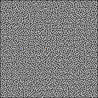
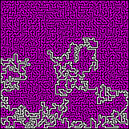

## DEFCON1

### Description

DEFCON is the website controlling the security level of the room. The 5 different levels allows to warn the population of the risk of a potential nuclear war. Levels ranges from 5 (peacetime) to 1 (maximum alert). Try level 1.

### Details

- Categories : Reverse
- Validations : 5
- Url : http://defcon.challs.malice.fr/
- Points : 300

### Resolution

For this challenge, we only have this in the scripts.js file:

```
function check1(pwd) {
  return checkcheck1(pwd);
}
```

#### Preliminary Analysis

Indeed, the *checkcheck1(pwd)* function is defined in another JS file, `x.js`. The *checkcheck1* function is defined line 2433. It checks if the length of the password is 2703, define two variables *pos=[75,79]* and *walls* composed of many many slices *[i,j]*. The values of i and j are between 0 and 160.

The code from line 2442 to 2463 browses the characters of the password and checks if its value is *117=’u’, 100=’d’, 108=’l’ or 114=’r’*, and update the *pos* variable accordingly. It seems like a maze with the walls defined in the variable *walls*, with four possible movements *up, down, left, right*. Line 2459, the code checks if the value of *pos* is contained inside *walls*, or if the pos is out of the labyrinth. After looping over the password, line 2464, the code checks if *pos=[34,79]*. The alert message line 2468 suggests to apply the SHA512 algorithm on the password to obtain the flag.

So, the password is a path to go from [75,79] to [34,79] inside the maze defined by *walls*.

The following pseudo-code gives a clear idea of the code of the *checkcheck1* function:

```
checkcheck1 = function(pwd) {
  var _1, i, pos, pwd, walls;

  // Length of password should be 2703
  if (!((pwd.length === 2703))) {
    return false;
  }

  // Initial position
  pos = [75, 79];
  // Walls
  walls = [[0, 1],[0, 2],[0, 0],[1, 2], ... , [160, 160],[160, 159],[160,160],[160, 158]];
  
  i = 0;
  // Loop over password characters
  while (true) {
    if (!(i < pwd.length)) { break; }
    _1 = pwd.charCodeAt(i);

    // 117 = 'u' (up)
    if (_1 === (117)) {
      pos = [pos[0] - 1, pos[1]];

    // 100 = 'd' (down)
    } else if (_1 === (100)) {
      pos = [pos[0] + 1, pos[1]];

    // 108 = 'l' (left)
    } else if (_1 === (108)) {
      pos = [pos[0], pos[1] - 1];

    // 114 = 'r' (right)
    } else if (_1 === (114)) {
      pos = [pos[0], pos[1] + 1];

    } else {
      return false;
    }

    if ((pos in walls) || out_lab(pos)) {
      return false;
    }

    i = i + (1) >> 0;
  }

  // End at [34;79] ?
  if (!pos == [34,79]) {
    return false;
  }
  alert("Well Done! Send the flag encoded with Sha512 to get your points!", $String);
  return true;
};
```

#### Welcome to the Maze

First, lets print the maze to have an idea of the problem. 



I printed the maze using : x = column, y = line (I don’t think this change anything, but... Anyway !). Of course, the problem is too hard to be solved by hand (remember, password length = 2703...). A simple recursive algorithm exists to resolve a maze, but the prolem here is too complicated and needs too much recursions for a simple Python solution. Also, the problem seems to be solvable by applying the A* algorithm. However, a more “graphical” solution is proposed here. The main idea is that the dead-end are not interesting. Also, we don’t want to go out of the maze, so we add walls at *[x=69,y=160]* and *[x=151,y=160]* (see the two white pixels at the periphery !). A dead-end is defined as a point that has exactly 3 walls around. The script `color_maze.py` browses the maze and looks for dead-ends.

If a dead-end is found, it is painted in violet. Each violet cell is then considered as a wall. The algorithm continues until no more modification is performed. It takes a few minutes to run entirely (around 5min). Here is the output image : 



The right path is clearly visible ! However, there are 2712 white cells instead of 2702. In fact, a few cells remains white because of the location of the blue pixel. The image can be easily modified by hand using Gimp, for example.

#### Path to the Flag

To retrieve the flag from the image, the path from the orange to the blue pixel should be traduced into u, d, l, r. The script `get_path.py` is used to retrieve the path.

The following path is found (veeeeery long path):
```
uurrddrrrrrruurrddrrddllddllddlluuuullddddllllddddllddddrruurrddrrrrddddrrdddd
rruurruulluuuuuulluuuurrddrruuuurrrruulluuuurruurruulllllluulllllluullllddddll
lluuuulluulluulllllluuuullllddddrrddrrrrrrddddrrddllddrrrrddddlluullddllddlldd
rrddrrrrddlllllluullddddlluullddllllllddllddrrddddrrddrrrruulluurrrrddrruurrrr
rrddrruurrrrddllddlllllluullddllllddllllddlluullddddrrddllddrrddllddlluulllluu
rrrruulllluullddddddddrrddddllddrrrrddddrrrrrrrruuuuuuuulluurruurrddddddddddrr
rrrruurrddrruuuurrddddrrddrrrrrrrrrruurruullllllddlllluuuurrrruurrrruurrrruuuu
uuuurrrrddrruurrrruuuullddlluulluuuurruuuuuuuulluuuurrrruurruuuuuuuurruurrddrr
uuuurrrrrrrrrrrrddddddrrddddddddlluuuuuulluulluullddddddrrddddrrddddllddlluuuu
uulllluullddllllllddddrrddllllddrrddddrruurrrruuuurrrrddllddddrrddrrddlllldddd
rruurrddddrrddlllllluulllluuuullddddddddrruurrddrrrrrrddddddddddllddrrrrrruurr
ddddrrrruurrrrrrrrddddllllddrrddllddddlluuuulluuuullllllllddlllluullddllddrrdd
rrrrrrrrrrrrddddrrrrrrddddllllddddlluuuuuulluulluullddlluullddddrrrrddddddddrr
rrrrddllllllddrrddllddrrddllddrrddrruuuurrddddrruurrrrddrrrrrruurrrruurruurruu
rruurrddrrrrrrrrddddlllluullddlluullddddrrrrrrrrddrrrrrruulluuuuuuuulluulluuuu
rrddrruuuulllluullddddddllddlllllluuuulluurrrruurrddrruuuuuuuurrrrddrruurrdddd
llddrrrrddrrddddddrruuuuuuuuuuuuuuuulluuuullddllddlllllllluuuurruulllluurrrrrr
rrddrruurruurrrruulllllllluulluulluurrrrrrrrrrrruuuuuuuullddlluulluurrrruurruu
uuuuuullddddddllddlllluuuuuurruulluurruurrddrruuuurruulllllllluulllluuuurrrrrr
uulllluuuullddllllddllllddddllddlllluullllddllddlluuuulluurrrrrruurruurrddddrr
uurruuuulllllluuuulluuuurrddrrddrruuuuuurruurrrrrruuuurrddrrddllddllddddddlldd
rrrrrruuuulluurruurrrrrrddllddllddrrrrrruurruuuuuuuurruuuullllddddddlluuuullll
uurruurruurruurruullllddllddllddllllddlluullllddrrddddlllluullddlluuuulllllluu
uurrrrddrrrrrruuuurrrruuuuuurruulluuuuuulluulluurrrrrrddrrddllddrrddddddddlldd
ddrrrruuuuuurrddrrrrrrrruurruuuullddlluullddddlluuuullddlluuuurrrrrruuuurrrrdd
llddrrrruuuuuulllluulluuuulluuuuuuuurrrrrrrruulluurruuuuuullddddlllllluulluurr
uurrrruulluullllllddddddddllddddddrrddddlluullddddrrrrrrddddddrrddllddlluuuuuu
uullddddddlluullddlluullddllddlluuuulluurruurrddrrrrrrrruulluuuullddddlluulluu
uuuurruuuulllllluurrrruulluulluurruullllllddddrrddddlluullddlllluuuurrrruulluu
llddlluullllllddllddddrrddddddllddddllllllddrrrrddrrddlllluullllddlluuuuuullll
uurrrruulllllluurrrrrruulluurrrrrrddddllddrrrrddrruuuulluurruuuulllllllluurruu
llllllddlluullllddddddlllluuuullddddllddllddrrrrrrddddlluullddddrrrrrrddddddrr
ddrrrrrruuuuuurrddddddddddddllddlluulluuuullddddlllluulluullddddlllluuuuuuuurr
rrrrrruulluulllluulluulluulluurrrruuuuuurruulluullllllddrrddddddllddddddrrddll
llllllddddrrrrrrrrrrddllddrrddddddllllddddrruurrrrd
```

The application of SHA512 on the path gives the flag :
```
SHA512 : 7452d6d91da700d0d686e75dd28fa80a0c64f81a402fcba2b9c4f81cd18eb46e5c052cd0cd1f601b5f117ad94ec68505f7f8fde8adb4e34157f55873239205ae
```

